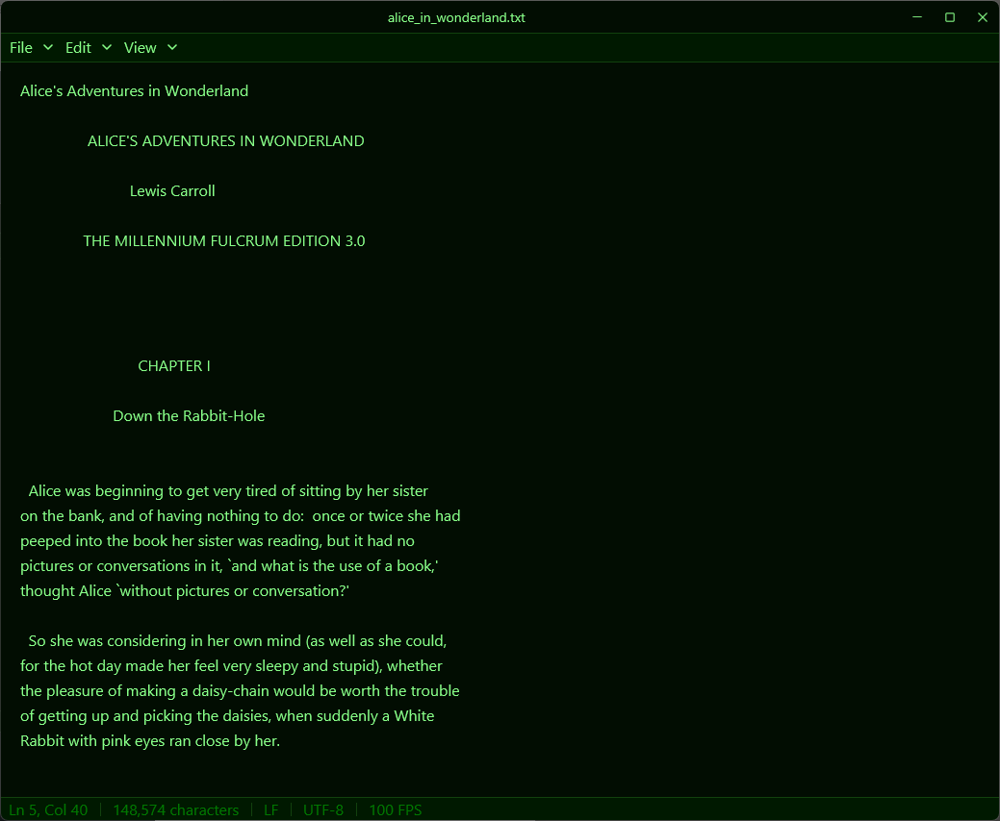

# OneText


**OneText** is a minimal text editor built in Rust. It focuses on single-file editing without the distraction of tabs, using `gpui` for high performance.



## ✨ Features

| Feature | Description |
| :--- | :--- |
| **Focus-First** | Single-file editing designed for concentration. |
| **Theming** | 20+ themes included (Dracula, Solarized, Catppuccin, etc.). |
| **Performance** | Built on `gpui` for instant startup and 120fps rendering. |
| **PDF Export** | Built-in PDF generation. |

## 📦 Installation

Download the latest installer from the **[Releases](https://github.com/codename-B/OneText/releases)** page.

The installer (`OneText-Setup-x.x.x.exe`) installs the app to Program Files and creates a Start Menu shortcut.

## 🛠️ Building from Source

To build OneText yourself, you'll need [Rust](https://www.rust-lang.org/tools/install) installed.

```powershell
# Clone the repository
git clone https://github.com/codename-B/OneText.git
cd OneText

# Build and run in release mode
cargo run --release
```

### Building the Installer (Windows)

Requires **Inno Setup 6**.

```powershell
# 1. Build release binary
cargo build --release

# 2. Compile installer
& 'C:\Program Files (x86)\Inno Setup 6\ISCC.exe' 'installer\onetext.iss'
```

## 🤝 Contributing

Contributions are welcome! Please feel free to open issues or submit pull requests.
